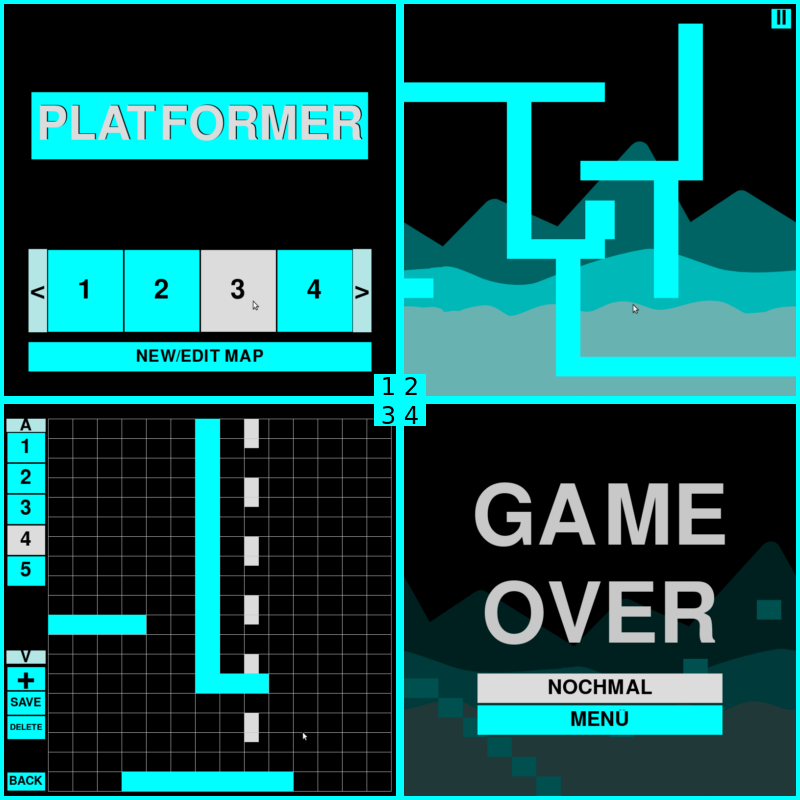

# Simple Platform Game
A small platform like game built in python with **pygame**.  
Without enemies, just jump and run.  
You can make your own level in the **level editor**

### Requierments (my version):
* Python (3.5)
* pygame (1.9)
* PIL (5.2)
* pickle (4.0)

### Screenshots:
1. *start menu*
2. *playing scene*
3. *level editor*
4. *game over menu*

### Music:
Royalty free Musik from [Bensound](https://www.bensound.com/royalty-free-music/track/slow-motion).
